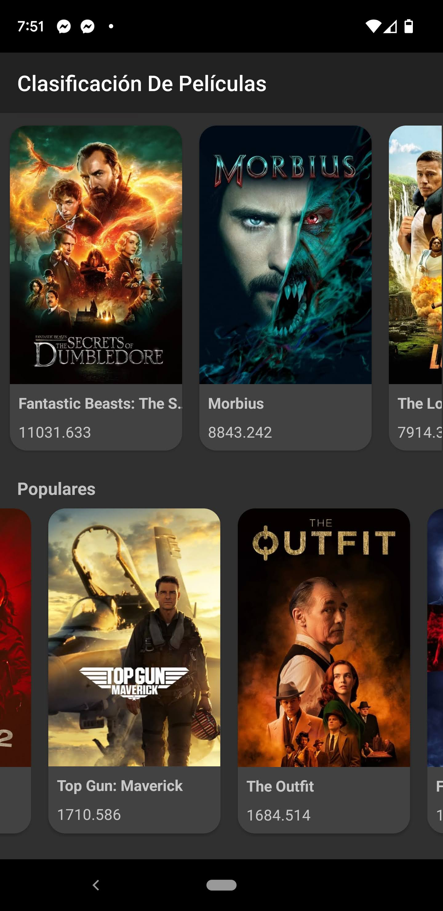
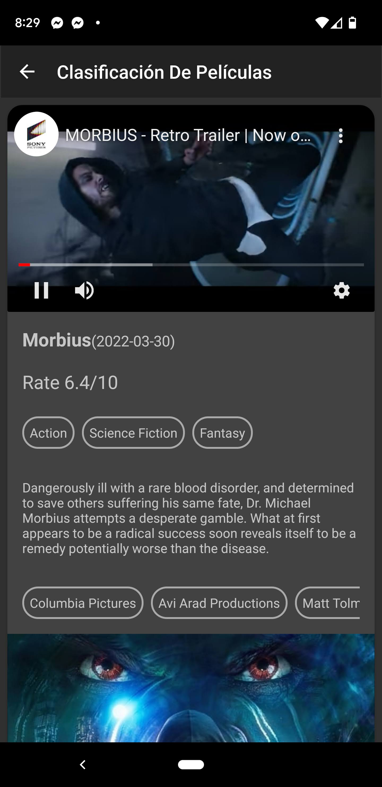

# App de Peliculas/series

## Desarrollador:
- Ulises Martínez Elías
ulises.mtz.el@gmail.com

## API's:
- https://developers.themoviedb.org/

## Funciones:
- Reproducción de videos de Youtube
- Conexión Http
- Renderización de imágenes
- Recycler View
- Arquitectura MVVM

## Bibliotecas
- Volley para la conexion a la API
- Glide para manejar los imageView
- [android-youtube-player](https://github.com/PierfrancescoSoffritti/Android-YouTube-Player) para reproducir los trailers de cada película

## Estructura

    appdepeliculas/
        +-- data/
        |     `-- network/
        |           `-- Repository.kt
        |
        +-- model /
        |     +-- Movie.kt
        |     +-- MovieDetail.kt
        |     `-- VideoData.kt
        |
        +-- view/
        |     +-- adapters/
        |     |      +-- MainAdapter.kt
        |     |      +-- MovieVideoAdapter.kt
        |     |      `-- TextViewAdapter.kt
        |     |
        |     +-- MainActivity.kt
        |     `-- MovieDetailActivity.kt
        |
        `-- viewmodel/
              +-- MainViewModel.kt
              `-- MovieDetailViewModel.kt

## Screenshots

